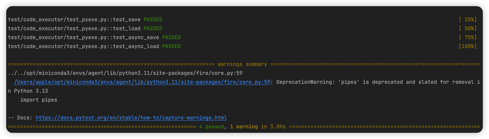

# Python 新手指南

**这是一个针对计算机小白的教程，大佬请自行绕路，谢谢。**

## 克隆代码仓库
使用IDE（推荐vscode，或者pycharm），在Terminal中输入如下命令实现代码仓克隆和进入code_executor项目根目录：
```bash
git clone https://github.com/xiaolun001/clean_code_in_python.git
cd clean_code_in_python/code_executor
```

## python环境配置
*如果你当前使用的python版本已经是3.11，请跳过这个环节。*
推荐使用 Visual Studio Code (VSCode) 结合 miniconda 配置 Python 开发环境。

### 软件下载和安装
- miniconda下载：推荐使用清华开源软件镜像站内容
  - 下载地址：https://mirrors.tuna.tsinghua.edu.cn/anaconda/miniconda/
  - channel配置和使用方法介绍：https://mirrors.tuna.tsinghua.edu.cn/help/anaconda/
- VSCODE下载地址：https://code.visualstudio.com/download

安装时最简单的做法就是不停接受默认设置就好。

### Python3.11环境创建
本小节介绍如何使用conda命令，创建一个名为agent的Python3.11环境。

```bash
conda create -n agent python=3.11
```
对于列表显示的需要安装的包，输入yes。

安装完成后，在Terminal中输入如下命令激活agent环境。
```bash
conda activate agent
```

### 使用poetry激活code_executor的项目环境
如果你没安装poetry，可以通过如下命令安装:
```bash
pip install poetry
```

确保你已经进入code_executor项目根目录，然后通过如下命令，以开发者模式安装库code_executor：
```bash
poetry install
```
当你在Terminal上你看到如下内容时，说明已经安装成功：


安装完成后，通过如下命令进入code_executor的虚拟环境。
```bash
poetry shell
```

## 执行code_executor 测试文件
确保你当前在clean_code_in_python目录下，输入如下命令，执行单元测试文件：
```bash
pytest -v test/code_executor/test_pyexe.py
```
当你看到如下内容，说明你的环境配置没有任何问题，而且code_executor也能正常使用。

